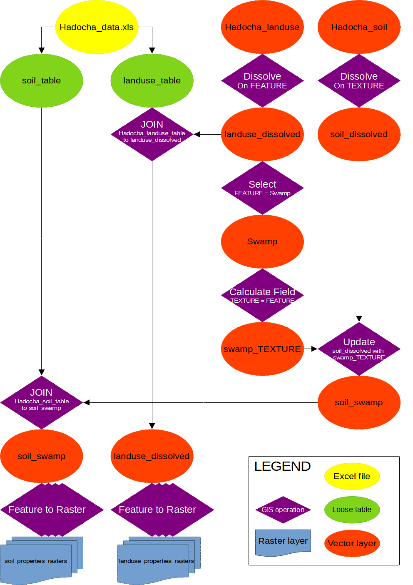

=======================
Pre-processing the data
=======================

In GIS you always need to process the raw data, to make it suitable as input for
your application. We consider this as the first step in the process. In total
there are three different phases: the pre-processing phase, where the input data
will be created from the raw data. The second phase is the processing, where
every step in the MMF method will be completed. The last phase is combining the
different steps to the complete model.

   Flowchart for the complete preprocessing workflow.

|basic| Managing files for processing
-------------------------------------

Even though GeoPackages are very useful for easy sharing of data, there are some
small quirks when opening rasters from them for models we made ourselves.
Therefore, we will be dumping all our rasters in a folder. 

#. Create a folder :file:`01_input` inside :file:`GIS_files`.

|basic| |FA| Updating :guilabel:`Hadocha_landuse`
-------------------------------------------------

Since updating the landuse map has the shortest workflow, we'll work on that
first. The data in :file:`data/Hadocha_landuse.xlsx` still needs some editing.

Pre-processing the tabular data
...............................

#. Open :file:`data/Hadocha_data.xlsx` in a spreadsheet editor like Libreoffice
   Calc
#. In the :guilabel:`landuse_properties_table` tab, have a look at the data. As
   you can see, the Cropland data is not annual, but hs different values for
   each month. Since the MMF model is annual, we need annual data. Calculate the
   annual intercepted rainfall (:math:`A`) by:

   .. math::
      :label: eq_rainfall

      A = \frac{A_{sow}*M_{sow}+A_{grow}*M_{grow}+A_{after}*M_{after}}{12}
    
   Where :math:`A_{sow,grow,after}` is the intercepted rainfall for that period
   (sowing, growing and after harvest) and :math:`M_{sow,grow,after}` the number
   of months in each period.

#. Calculate the other other factors by substituting :math:`A` in :eq:`eq_rainfall`
#. Make sure to name the row :file:`Cropland`

.. note::
   The rows will later be used to perform a :ref:`qgisjoinattributestable`
   operation. This will give the :guilabel:`Cropland` features of
   :guilabel:`Hadocha_landuse` the values of
   :guilabel:`landuse_properties_table`. This will only work if both rows have
   **exactly the same** names.

.. _joining_landuse:

Joining the data
................

Even though the join operation is only a single operation, we will put it inside
a model, so we can immediately rasterize the data afterwards.

#. Create a new model named :file:`01 update landuse` and |fileSave| Save it.

#. We need the following inputs:

   #. Vector Layer
      
      * :guilabel:`Description` landuse
      * :guilabel:`Geometry type` |selectString|:file:`Polygon`
      * |checkbox|:guilabel:`Mandatory`
      * |unchecked|:guilabel:`Advanced`

   #. Vector field
      
      * :guilabel:`Description` :file:`Landuse join field`
      * :guilabel:`Parent layer` |selectString|:file:`Landuse`
      * :guilabel:`Allowed data type` |selectString|:file:`String`
      * |unchecked|:guilabel:`Accept multiple fields`
      * :guilabel:`Default value`: :file:`FEATURE`
    
   #. Vector Layer
       
      * :guilabel:`Description` :file:`Landuse properties`
      * :guilabel:`Geometry type` |selectString|:file:`No geometry required`
    
   #. Vector field

      * :guilabel:`Description` :file:`landuse properties join field`
      * :guilabel:`Parent layer` |selectString|:file:`Landuse properties`
      * :guilabel:`Allowed data type` |selectString|:file:`String`
      * |unchecked|:guilabel:`Accept multiple fields`
      * :guilabel:`Default value`: :file:`Landuse`

#. Drag the |logo| :ref:`qgisjoinattributestable` algorithm into the modeler.
   
   * :guilabel:`Input layer`:  |processingModel| :file:`Landuse`
   * :guilabel:`Table field`: |processingModel| :file:`Landuse join field` 
   * :guilabel:`Input layer 2`: |processingModel| :file:`Landuse properties`
   * :guilabel:`Table field 2`: |processingModel| :file:`Properties table join field`
   * |modelOutput|:guilabel:`Joined layer [optional]`: :file:`Landuse_joined` 
   
#. |play| Run the model and look at the attribute table. It should look like
   this:
   
   .. figure:: img/landuse_joined_table.png
      :align: center

   Note that there may be additional, unnecessary columns like :file:`Field9`
   with all :file:`NULL` values. These are okay.

   .. note::
      It may be that your Cropland row will have all *NULL* values. If that is
      the case, check:

      #. If you have calculated the values
      #. It may be that the values don't load if they are a formula. This should
         be a bug and is hopefully solved soon. Replace your formulas with the
         resulting numbers!

.. _rasterize_landuse:

Rasterizing the results
.......................

Now, we will be going to rasterize all our outputs. This is normally done by the
|gdal|:ref:`gdalrasterize` process. To make this easier, two convenience scripts have
been added: one that allows you to rasterize a single vector layer with the same extent
and pixel size as another raster layer, and one that allows you to do the same for
multiple rasters. We will be using the batch rasterizing script, and you can use the
other one later if you need to.

#. Add the :file:`batch_rasterize_final.py` 
   `convenience script <https://github.com/feefladder/QGIS-Documentation/raw/convenience-scripts/scripts.zip>`_ 
   to the toolbox. like you did in :ref:`adding_script_to_toolbox`.
#. We will need another input |signPlus| Raster Layer 
   :file:`reference layer`. This is the layer that will be used to calculate the
   extent. Open up :guilabel:`01_update_landuse` again and add it.
#. Also add another |signPlus| Vector field input with:

   * :guilabel:`Description` :file:`Rasterize fields`
   * :guilabel:`Parent layer` |selectString|:file:`landuse properties table`
   * :guilabel:`Allowed data type` |fieldInteger|:file:`number`
   * |checkbox|:guilabel:`Accept multiple fields`
   * |checkbox|:guilabel:`Select all fields by default`

#. drag in the |pythonFile|:guilabel:`Batch_rasterize_fields` script you added and set:

   * :guilabel:`like raster` |processingModel|:file:`reference layer`
   * :guilabel:`vector` 
     |processingAlgorithm|:file:`"Joined layer" from algorithm "Join attributes by field value"`
   * :guilabel:`fields to select` |processingModel|:file:`rasterize fields`
   * |modelOutput|:guilabel:`Output directory` :file:`Output directory`

   Your model should now look like this:
   
   .. figure:: img/landuse_model_rasterize_batch.png
      :align: center

#. We also want our output to be automatically saved to a non-temporary
   location. Double click the :guilabel:`Output directory` output and set it to a location:

   .. figure:: img/landuse_model_default_output.png
      :align: center

      Setting a default output for intercepted rainfall. :file:`01_input` is a
      folder, not a GeoPackage.

#. |play| Run the model and verify that the output has data values for all areas.

|basic| |FA| Updating :guilabel:`Hadocha_soil`
----------------------------------------------

Now it is time to start working on our soil layer! Because there is a swamp
(landuse) which has quite different properties than the surrounding land, we
will first put that in our map

|basic| |FA| Adding Swamp to the Soil map
.........................................

#. Create a new model. Name it :file:`02 Update Soil` 
#. Give it the following inputs:

   #. |polygonLayer| Vector Layer: :file:`Soil` 
   #. |polygonLayer| Vector Layer: :file:`Landuse`

#. Now, we want to select the :guilabel:`Swamp` feature from
   :guilabel:`Landuse`. Drag the |processingAlgorithm|:guilabel:`Extract by Attribute`
   process into the modeler.

   * :guilabel:`Input layer`: |processingModel|:file:`Landuse`
   * :guilabel:`Selection attribute`: |fieldInteger|:file:`FEATURE` 
   * :guilabel:`Operator`: |fieldInteger|:file:`=` 
   * :guilabel:`Value [optional]`: |fieldInteger|:file:`Swamp`
  
   Also give :guilabel:`Extracted (attribute)` a name and |play|:guilabel:`Run`
   the model. Your resulting layer should only be the swamp.

   .. note::
      It is good practice to run and check your model after each step/algorithm
      you put in. This will not really be said from now on, but we expect you to
      do this. Also if your final output is wrong, go back in the model and
      check every earlier output for an error.

#. Next, we want to combine our :guilabel:`Swamp` into the :guilabel:`Soil`
   layer. Drag a |logo|:ref:`qgisunion` into the modeler with:

   * :guilabel:`Input layer`: |processingModel|:file:`Soil` 
   * :guilabel:`Overlay layer`: 
     |processingAlgorithm|:file:`"Extracted (attribute)" from algorithm "Extract by attribute"` 

   Run the model and check the output attribute table. 

   .. figure:: img/preprocessing_soil_unioned.png
      :align: center

   Notice that there is a field :guilabel:`TEXTURE` and a field
   :guilabel:`FEATURE`. In the next step, we will combine these, such that the
   *TEXTURE* for all features that have :code:`FEATURE=='Swamp'` will be *Swamp*.
      
#. Drag in the |logo|:ref:`qgisfieldcalculator` tool into the model.

   * :guilabel:`Input layer`: |processingAlgorithm|:file:`"Union" from "Union"` 
   * :guilabel:`Field name`: |fieldInteger|:file:`TEXTURE` 
   * :guilabel:`Result field type`: |fieldInteger|:file:`String` 
   * :guilabel:`Result field length`: |fieldInteger|:file:`16` This is the maximum
     length that the resulting field can have in characters
   * :guilabel:`Formula`: :file:`IF("FEATURE"='Swamp',"FEATURE","TEXTURE")` 

   Now, let's break this down a bit: Double quotes (:file:`""`) indicate a
   *field*. For example, :file:`"FEATURE"` will take values of :file:`'Swamp'`
   or :file:`NULL`. Single quotes (:file:`''`) indicate a *String*. This is just
   a sequence of letters such as :file:`'Swamp'`. The :file:`IF()` works like:
   :file:`IF(something is true, then this, otherwise this)`. The resulting
   attribute table should look like this:

   .. figure:: img/preprocessing_soil_calced.png
      :align: center
   
   This still has some unnecessary fields, and multiple features that have the
   same :guilabel:`TEXTURE`.

#. Drag in the |logo|:ref:`qgisaggregate` operation. This is a sort of
   |logo|:ref:`qgisdissolve` operation, but it offers more control over the
   output. Fill it in like this:
   
   * :guilabel:`Input layer`: 
     |processingAlgorithm|:file:`"Calculated from algorithm "Field calculator"`
   * :guilabel:`Group by expression`: |fieldInteger| |selectString|:file:`TEXTURE` 
   * :guilabel:`Aggregates`: Click the |newAttribute|:guilabel:`Add new field`
     button to add a new field. and fill it in like this:
   
     +-------------------+--------------------+---------+---------------+--------+
     | Source expression | Aggregate Function | Name    | Type          | Length |
     +-------------------+--------------------+---------+---------------+--------+
     | "TEXTURE"         | first_value        | TEXTURE | Text (string) | 16     |
     +-------------------+--------------------+---------+---------------+--------+
   
   .. tip:: in stead of adding the above fields manually, you can also
      :guilabel:`Load fields` from a similar layer.
   
   Your resulting layer should have a single column named *TEXTURE* and look
   like this:
   
   .. figure:: img/preprocessing_soil_agged.png
      :align: center

|basic| |TY| Join soil properties and rasterize
...............................................

The only thing we need to do now, is to join the excel table and rasterize the
results This is exactly the same as we did for the landuse maps, so we will give
less instructions.

#. Change the model such that soil properties are joined to the map. For
   reference, see :ref:`joining_landuse`. 

   .. admonition:: Hint
      :class: dropdown

      Your final model should look like this:

      .. figure:: img/preprocessing_soil_model_joined.png
         :align: center 

#. Finally, rasterize the results. For reference, see :ref:`rasterize_landuse`:

   .. list-table::
      :header-rows: 1

      * - :guilabel:`Field to use for a burn-in value [optional]`
        - :guilabel:`Rasterized`
        - :guilabel:`Description`
      * - :file:`Wfc`
        - :file:`Wfc`
        - Soil wetness at field capacity :math:`%` 
      * - :file:`bulk_density` 
        - :file:`bdod` 
        - Soil bulk density :math:`\frac{Mg}{m^3}`
      * - :file:`K`
        - :file:`K`
        - Soil detachability :math:`\frac{g}{J}`
      * - :file:`Coh` 
        - :file:`Coh` 
        - Soil cohesion :math:`kPa` 

   .. admonition:: Final model
      :class: dropdown

      .. figure:: img/preprocessing_soil_model_rasterized.png
         :align: center

.. warning:: Check that all values of the rasters you have created are the same
   as in the :file:`Hadocha_data.xlsx` file before moving on! Also, it is very
   important that the rasters align **exactly** with :guilabel:`Hadocha_dem`,
   otherwise, you will get errors in the |gdal|:ref:`gdalrastercalculator`. This
   should be good if you followed this manual.

.. Substitutions definitions - AVOID EDITING PAST THIS LINE
   This will be automatically updated by the find_set_subst.py script.
   If you need to create a new substitution manually,
   please add it also to the substitutions.txt file in the
   source folder.

.. |FA| replace:: Follow Along:
.. |TY| replace:: Try Yourself
.. |basic| image:: /static/common/basic.png
.. |checkbox| image:: /static/common/checkbox.png
   :width: 1.3em
.. |fieldInteger| image:: /static/common/mIconFieldInteger.png
   :width: 1.5em
.. |fileSave| image:: /static/common/mActionFileSave.png
   :width: 1.5em
.. |gdal| image:: /static/common/gdal.png
   :width: 1.5em
.. |logo| image:: /static/common/logo.png
   :width: 1.5em
.. |modelOutput| image:: /static/common/mIconModelOutput.png
   :width: 1.5em
.. |newAttribute| image:: /static/common/mActionNewAttribute.png
   :width: 1.5em
.. |play| image:: /static/common/mActionPlay.png
   :width: 1.5em
.. |polygonLayer| image:: /static/common/mIconPolygonLayer.png
   :width: 1.5em
.. |processingAlgorithm| image:: /static/common/processingAlgorithm.png
   :width: 1.5em
.. |processingModel| image:: /static/common/processingModel.png
   :width: 1.5em
.. |pythonFile| image:: /static/common/mIconPythonFile.png
   :width: 1.5em
.. |selectString| image:: /static/common/selectstring.png
   :width: 2.5em
.. |signPlus| image:: /static/common/symbologyAdd.png
   :width: 1.5em
.. |unchecked| image:: /static/common/unchecked.png
   :width: 1.3em
