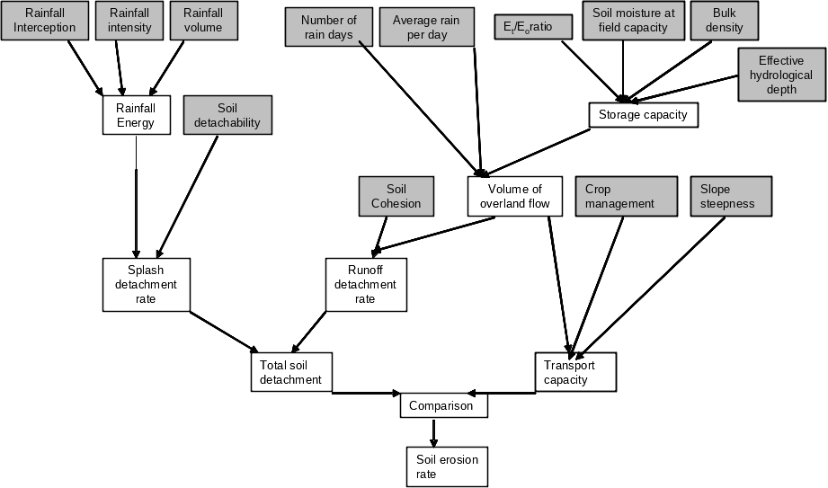
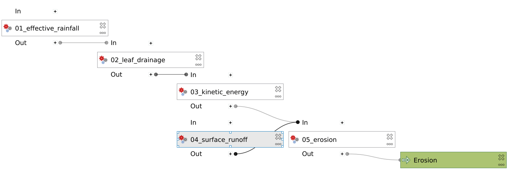

====================================
Processing the data in the MMF model
====================================

Now it is time to start processing our data. We will describe fully how to
implement the first set of equations. We will be making quite some small models
that can later all be combined into one big model. This will help in debugging.

Estimating effective rainfall (:math:`P_e`)
-------------------------------------------

The rainfall kinetic energy (:math:`KE [\frac{J}{m^2}]`) is a function of
effective rainfall (:math:`P_e` ), i.e. the fraction of mean annual rainfall
(:math:`P`) that is not intercepted by vegetation (:math:`A`). Thus:

.. math::
   :label: eq_p_effective

   P_e = P(1-A)

#. Create a new model
#. Give it two *Raster Layer* inputs: :file:`P` and :file:`A` 
#. Drag in a |gdal|:ref:`gdalrastercalculator` or a
   |logo|:ref:`qgisrastercalculator`.

   :|gdal| GDAL: Fill in the following:
                 
                 * :guilabel:`Input layer A`: |processingModel|:file:`A` 
                 * :guilabel:`Number of raster band for A`: |fieldInteger|:file:`1` 
                 * :guilabel:`Input layer B`: |processingModel|:file:`P`
                 * :guilabel:`Number of raster band for B`: |fieldInteger|:file:`1` 
                 * :guilabel:`Expression`: |fieldInteger|:file:`B*(1-A)`
                 * |modelOutput| :guilabel:`Calculated:` : :file:`Pe` 

   :|logo| Native: Fill in like so:

                   * :guilabel:`Expression`: :file:`"P@1"*(1-"A@1")`
                   * :guilabel:`Reference Layer(s)`: |processingModel|:file:`A`
                     or :file:`P`
                   * |modelOutput| :guilabel:`Output`: :file:`Pe` 

   Notice the difference in :guilabel:`Expression` between the two. Because we
   are directly using inputs, the expression in |logo| is still relatively
   compact. However, if you start stacking algorithms on top of each other, they
   may quickly become quite long

#. Optionally, set a default location for the output raster
#. Name the model :file:`01_effective_rainfall` and save it under a name

Leaf Drainage and Direct Throughfall
------------------------------------

#. Create a new model named :file:`02_leaf_drainage` 
#. Drag in the necessary raster layer inputs for the following equations:

   .. math:: LD = P_e \cdot CC\\
      DT = P_e - LD
   
   .. admonition:: Solution
      :class: dropdown

      .. figure:: img/model_02_leaf_drainage.png

.. _kinetic_energy:

Kinetic energy
--------------

#. Create a new model named :file:`03_kinetic_energy` 
#. Drag in the inputs for the followinw equations:

   .. math:: 
      KE_{DT} = DT\cdot(11.9+8.7\log(P_i))\\
      KE_{LD} = LD\cdot(18.80\cdot\sqrt{PH}-5.88)\\
      KE = KE_{DT}+KE_{LD}
   
   Where :math:`P_i=11\frac{mm}{h}` is the rainfall intensity and :math:`PH` is the
   plant height.

   .. note::
      In the |gdal|:ref:`gdalrastercalculator`, you can use any Numpy
      functions, such as `log10 <https://numpy.org/doc/stable/reference/generated/numpy.log10.html#numpy.log10>`_. 
      or sqrt. Additionally, powers are written as: ``2**3=8``.
   
   .. admonition:: Checkpoint

      Check that :math:`KE_{DT}\in[0,31254]` and :math:`KE_{LD}\in[816,17840]`.
      (For a rainfall of 1744)
   
   .. admonition:: Hint
      :class: dropdown

      You can rename your algorithms, so that you can actually distinguish them!
      Otherwise, they will all be called 
      :guilabel:`"Calculated" from algorithm "Raster Calculator"`:

      .. figure:: img/model_03_kinetic_energy.png
         :align: center   

Surface Runoff
--------------

Now, this will be a bit more complicated. For knowing the surface runoff on a pixel, we
need to also know the surface runoff of all the pixels above it. This is a process
called flow accumulation. 

.. note::

   There are some algorithms by |grassLogo| GRASS and |saga| SAGA
   that can do this. However, since the |saga| algorithms for flow accumulation are
   different between versions, and |grassLogo| algorithms do not allow for a weighted
   input, I made a plugin that we will be using that wraps the 
   `richdem <https://richdem.com>`_ utilities and makes them useable in QGIS.

The Soil moisture storage capacity :math:`S_c` is calculated by

.. math:: S_c = 1000 \cdot W_{fc}\cdot \rho_{bd}\cdot EHD\sqrt{\frac{ET_{c,adj}}{ET_c}}

Where :math:`W_{fc}` is soil moisture, :math:`\rho_{bd}` is Bulk density,
:math:`EHD` is effective hydrological depth and :math:`\frac{ET_{c,adj}}{ET_c}`
is the ratio of evapotranspiration.

The resulting estimate for surface runoff per pixel is then:

.. math:: 
   \delta SR = P\cdot \exp\left(-\frac{S_c}{P_0}\right)\\
   P_0 = \frac{P}{n}

where :math:`P_0` is the mean rain per day: Annual rainfall :math:`P` and number
of rainy days :math:`n=160`.

#. Create a model implementing the above equations
#. Load the map for :math:`\delta SR`. It should look like this:

   .. figure:: img/model_04_SR_map.png
      :align: center

      The values should be :math:`\delta SR\in[0,57]`

   Next, we need to route the flow. That is: for each pixel we know the runoff,
   and we want to calculate how it flows over the catchment.

Flow accumulation using |qrichdem|:guilabel:`rdflowaccumulation`
................................................................

   For this we will
   use the |qrichdem| :guilabel:`rdflowaccumulation` algorithm. However,
   our DEM contains some flat areas and depressions from which the algorithm
   does not know where to direct the flow. For this, we will use the 
   |qrichdem|:guilabel:`rddepressionfill` algorithm.

#. In your model, drag in a |qrichdem|:guilabel:`rddepressionfill` and set it to
   |processingModel| :file:`DEM` (Create a new input). Default settings are good.
#. Drag in a |qrichdem|:guilabel:`rdflowaccumulation` and fill it in like
   this:

   * :guilabel:`input layer`: 
     |processingAlgorithm|:file:`"Output layer" from algorithm "rddepressionfill"`
   * :guilabel:`flow metric`: |fieldInteger|:file:`Dinf`
   * :guilabel:`weights [optional]`: 
     |processingAlgorithm|:file:`"Calculated" from algorithm "SR"`
   * |modelOutput|:guilabel:`Output layer`: :file:`SR_acc` 

Flow accumulation using |saga|:guilabel:`Catchment area`
........................................................

#. In your model, drag in a |saga|:guilabel:`Fill sinks` and set it to
   |processingModel| :file:`DEM` (Create a new input). The minimum slope is good
   on default settings.

   .. note::
         |saga| SAGA is **very** specific when it comes to misaligned rasters. It
         can be that your rasters misalign by :math:`10^{-6}` and it will give a
         :file:`The Following layers were not correctly generated` error. Because of
         this, we will use :ref:`gdalwarpreproject` to align the dSR raster to the filled DEM,
         as explained `in this blog <https://gis.stackexchange.com/a/422090/156742>`, explained in `this blog <https://www.luisalucchese.com/post/saga-gis-error-catchment-area/>`_.

#. Drag in a |gdal|:ref:`gdalwarpreproject` algorithm. Press :guilabel:`Show advanced parameters` and fill in the following:

   * :guilabel:`Input layer`: |processingAlgorithm|:file:`"Calculated" from algorithm "dSR"`
   * :guilabel:`Source CRS [optional]`: |processingAlgorithm|:file:`"Calculated" from algorithm "dSR"`
   * :guilabel:`Target CRS [optional]`: |processingAlgorithm|:file:`"Filled DEM" from algorithm "Fill sinks (wang & liu)"`
   * :guilabel:`Georeferenced extents of output file to be created [optional]`: |processing|:file:`"Filled DEM" from algorithm "Fill sinks (wang & liu)"`

#. Drag in a |saga|:guilabel:`Catchment area (flow tracing)` and fill it in like
   this:

   * :guilabel:`Elevation`: 
     |processingAlgorithm|:file:`"Filled DEM" from algorithm "Fill sinks"`
   * :guilabel:`Flow Accumulation units`: |fieldInteger|:file:`[0] number of cells`
   * :guilabel:`Weights`: |processingModel|:file:`"Calculated from algorithm "SR"`
   * :guilabel:`Method`: |fieldInteger|:file:`[3] Deterministic infinity` This is the flow routing
     algorithm.

#. Run the model. If everything works correctly, you should get the following output:

   .. figure:: img/model_04_acc_map.png
      :align: center

      Your values should be :math:`\in[0,800000]` 

   Now, we are not interested in how much flow accumulates in the river areas.
   We will say that for any cell with :math:`SR>1400` this is a river area and
   set :math:`SR_{final}=0` there.

#. Drag in a |gdal|:ref:`gdalrastercalculator`. The expression you should fill in is:
   |gdal| :file:`where(A<1400,A,0)`, using the 
   `numpy.where() <https://numpy.org/doc/stable/reference/generated/numpy.where.html>`_.
   Make sure that :guilabel:`Input layer A` points to  
   :file:`"Flow Accumulation" from algorithm "Catchment area"`:

   .. figure:: img/model_04_SR_final_map.png
      :align: center
   
   .. tip::
      If you find yourself filling in inputs all the time, you can create a new
      model, drag in the |processingModel|:guilabel:`04_surface_runoff`
      algorithm, and selecting the inputs as paths to the rasters.

Estimate soil detachment by raindrops :math:`F [\frac{kg}{m^2}]`  and runoff :math:`H []\frac{kg}{m^2}]` 
--------------------------------------------------------------------------------------------------------

Soil particle detachment by runoff :math:`H` is given by:

.. math:: H=10^{-3}\frac{2SR^{1.5}}{COH}\sin(S)(1-GC)

Where :math:`COH [kPa]` is cohesion, :math:`SR [mm]` (use :guilabel:`SR_final` )
volume of surface runoff, :math:`S [\rad]` is slope and :math:`GC [-]` is
fraction of ground cover.

#. Create a new model named :file:`05_detachment`
#. Drag in a :guilabel:`DEM` input and a |qrichdem| terrain attribute algorithm.
#. Next, drag in a |logo|:ref:`qgisrastercalculator` and fill in the equation.
   (|gdal| does not properly mask nodata values here and gives an "overflow encountered
   error" here. This is safe to ignore)

.. admonition:: Solution
   :class: dropdown

   If you have filled in :guilabel:`A` : |processingModel|:file:`SR`,
   :guilabel:`B` : |processingModel|:file:`COH`, :guilabel:`C` :
   |processingAlgorithm|:file:`"Slope" from algorithm "Slope"`, :guilabel:`D` :
   |processingModel|:file:`GC`, then the final expression is:

   :file:`0.0005*A**1.5/B*sin(deg2rad(C))*(1-D)` 

   It could be that |gdal| does not like raising to a power. Then, you could try the
   |logo| raster calculator.

   .. figure:: img/model_05_h.png
      :align: center

   The final value should be :math:`H\in[0,1.2]`

Soil particle detachment by raindrops, :math:`F` is given by:

.. math:: F=10^{-3}K\cdot KE

where :math:`K [\frac{g}{J}]` is the soil detachability index and :math:`KE [J]`
is kinetic energy determined in :ref:`kinetic_energy`.

#. Add this calculation to the model

Calculating transport capacity and final erosion
------------------------------------------------

Since we will also be using the slope in this model, we will be making the rest
of our calculations in the same model.

The transpor capacity is given by:

.. math:: TC = 10^{-3}C_fSR^2\sin(S)

Again, I used a |logo|:ref:`qgisrastercalculator` to calculate :math:`SR^2`, and
filled this in into the model.

Next, the final erosion is given by:

.. math:: E = \min(F+H, TC)

Use the :file:`minimum()` to calculate this in |gdal|:ref:`gdalrastercalculator`.

.. admonition:: Solution
   :class: dropdown

   The final model looked like this for me:

   .. figure:: img/model_05_final.png
      :align: center

      The final model layour for detachment and erosion
   
   And the final erosion map looked like this:

   .. figure:: img/E.png
      :align: center

      Values are between :math:`0,14.9` 
      

Putting everything into a single model
--------------------------------------

Now, you can create a new model and drag all the algorithms into it! Make sure
to **only** set inputs as paths to files where they are acutally inputs from
pre-processing. Otherwise use an |processingAlgorithm|:guilabel:`Algorithm output` from a
previous algorithm. It should look like this:

.. Substitutions definitions - AVOID EDITING PAST THIS LINE
   This will be automatically updated by the find_set_subst.py script.
   If you need to create a new substitution manually,
   please add it also to the substitutions.txt file in the
   source folder.

.. |fieldInteger| image:: /static/common/mIconFieldInteger.png
   :width: 1.5em
.. |gdal| image:: /static/common/gdal.png
   :width: 1.5em
.. |grassLogo| image:: /static/common/grasslogo.png
   :width: 1.5em
.. |logo| image:: /static/common/logo.png
   :width: 1.5em
.. |modelOutput| image:: /static/common/mIconModelOutput.png
   :width: 1.5em
.. |processingAlgorithm| image:: /static/common/processingAlgorithm.png
   :width: 1.5em
.. |processingModel| image:: /static/common/processingModel.png
   :width: 1.5em
.. |qrichdem| image:: /static/common/qRichDem.png
   :width: 1.5em
.. |saga| image:: /static/common/providerSaga.png
   :width: 1.5em
