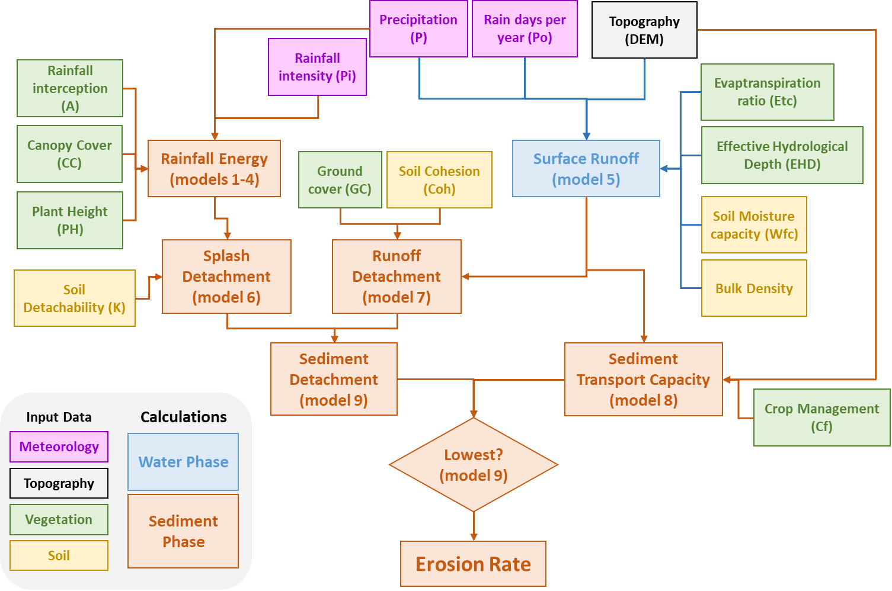

====================================
Processing the data in the MMF model
====================================

Now it is time to start processing our data. We will describe fully how to
implement the first set of equations. We will be making quite some small models
that can later all be combined into one big model. This will help in debugging.

Estimating effective rainfall (:math:`P_e`)
-------------------------------------------

The rainfall kinetic energy (:math:`KE [\frac{J}{m^2}]`) is a function of
effective rainfall (:math:`P_e` ), i.e. the fraction of mean annual rainfall
(:math:`P`) that is not intercepted by vegetation (:math:`A`). Thus:

.. math::
   :label: eq_p_effective

   P_e = P(1-A)

#. Create a new model
#. Give it two *Raster Layer* inputs: :file:`P` and :file:`A` 
#. Drag in a |gdal|:ref:`gdalrastercalculator` or a
   |logo|:ref:`qgisrastercalculator`.

   :|gdal| GDAL: Fill in the following:
                 
                 * :guilabel:`Input layer A`: |processingModel|:file:`A` 
                 * :guilabel:`Number of raster band for A`: |integer|:file:`1` 
                 * :guilabel:`Input layer B`: |processingModel|:file:`B` 
                 * :guilabel:`Number of raster band for B`: |integer|:file:`1` 
                 * :guilabel:`Expression`: |integer|:file:`B*(1-A)`
                 * |processingOutput| :guilabel:`Calculated:` : :file:`Pe` 

   :|logo| Native: Fill in like so:

                   * :guilabel:`Expression`: :file:`"P@1"*(1-"A@1")`
                   * :guilabel:`Reference Layer(s)`: |processingModel|:file:`A`
                     or :file:`P`
                   * |processingOutput| :guilabel:`Output`: :file:`Pe` 

   Notice the difference in :guilabel:`Expression` between the two. Because we
   are directly using inputs, the expression in |logo| is still relatively
   compact. However, if you start stacking algorithms on top of each other, they
   may quickly become quite long

#. Optionally, set a default location for the output raster
#. Name the model :file:`01_effective_rainfall` and save it under a name

Leaf Drainage and Direct Throughfall
------------------------------------

#. Create

.. Substitutions definitions - AVOID EDITING PAST THIS LINE
   This will be automatically updated by the find_set_subst.py script.
   If you need to create a new substitution manually,
   please add it also to the substitutions.txt file in the
   source folder.

.. |gdal| image:: /static/common/gdal.png
   :width: 1.5em
.. |integer| image:: /static/common/mIconFieldInteger.png
   :width: 1.5em
.. |logo| image:: /static/common/logo.png
   :width: 1.5em
.. |processingModel| image:: /static/common/processingModel.png
   :width: 1.5em
.. |processingOutput| image:: /static/common/mIconModelOutput.png
   :width: 1.5em
