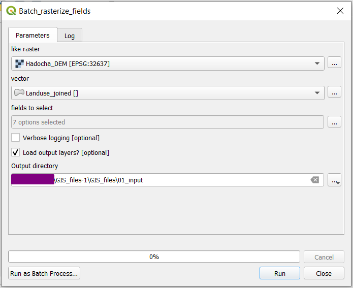
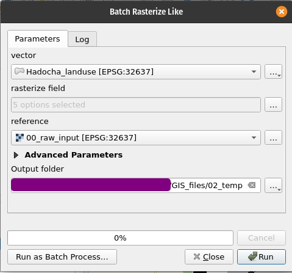
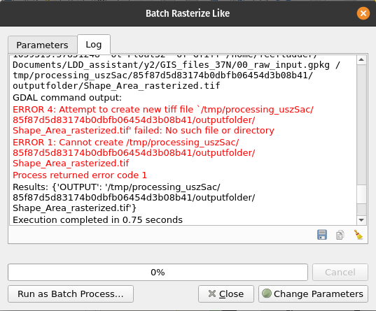

|moderate| |FA| Making a script for rasterizing like
----------------------------------------------------

The easiest - and first - change we will make is to make a rasterization tool that
automatically aligns the output raster to a reference raster. 

Creating a model and save as Python
...................................

Create a new model, name it :file:`Rasterize like` and add the following:

#. |signPlus| Raster layer named :file:`reference`
#. |signPlus| Vector layer named :file:`vector`
#. |signPlus| Vector field named :file:`rasterize field`
#. |signPlus| Number named :file:`nodata value` with:

   * :guilabel:`Default value`: :math:`-999`
   * :guilabel:`Number type`: :file:`Float`

#. |gdal|:ref:`gdalrasterize` with:

   * :guilabel:`Input layer`: |processingModel|:file:`vector`
   * :guilabel:`Field to use for a burn-in value`: |processingModel|:file:`Rasterize field`
   * :guilabel:`Output raster size units`: |selectString|:file:`Georeferenced units`
   * :guilabel:`Output extent`: |processingModel|:file:`reference`
   * |modelOutput| :guilabel:`Rasterized`: :file:`Rasterized`

#. Convert the  model to Python by clicking the |saveAsPython| icon.

.. literalinclude:: scripts/rasterize_like_raw.py
   :linenos:

.. _inspecting_model_script:

Inspecting the resulting Python script
......................................

A new screen will appear with quite a long script. Let's break it down! It
starts by a *docstring* (indicated by :file:`"""`):

.. literalinclude:: scripts/rasterize_like_raw.py
   :linenos:
   :lines: 1-6

Next, we import all necessary *classes* and *modules*:

.. literalinclude:: scripts/rasterize_like_raw.py
   :lineno-start: 8
   :lines: 8-17
   :emphasize-lines: 1,8

Next, the start of our class starts. This is indicated by:

.. literalinclude:: scripts/rasterize_like_raw.py
   :lineno-start: 20
   :lines: 20

.. note:: Inheritance
   Our :class:`BatchRasterize` class *inherits from*
   :class:`QgsProcessingAlgorithm <qgis.core.QgsProcessingAlgorithm>` (indicated by the brackets).
   This means that all methods and attributes of
   :class:`QgsProcessingAlgorithm <qgis.core.QgsProcessingAlgorithm>` are also available for
   :class:`BatchRasterize`.

All later lines are indented. This means that everything defines aspects of
that class. There are two important methods:

.. literalinclude:: scripts/rasterize_like_raw.py
   :lineno-start: 22
   :lines: 22-29

Is run at the start of the algorithm. Here we define which inputs are
available in the prompt. Note that all inputs are filled out. That's
convenient!

Next, the :class:`ProcessAlgorithm <qgis.core.ProcessAlgorithm>` function executes the actual model:

.. literalinclude:: scripts/rasterize_like_raw.py
   :lineno-start: 31
   :lines: 31-58

* :class:`feedback <qgis.core.QgsProcessingFeedback>` is how we can
  communicate with the user.
* :file:`results` is a dictionary for results
* :file:`outputs` is a dictionary for outputs (results to be loaded into
  QGIS)
* :file:`alg_params` is a dictionary with all parameters for
  |gdal|:ref:`gdalrasterize`. As you can see, the :file:`EXTENT`,
  :file:`FIELD` and :file:`INPUT` are already set.
* :meth:`processing.run` finally runs |gdal|:ref:`gdalrasterize`. and stores
  it as :file:`RasterizeVectorToRaster` inside :file:`outputs`.

The final methods define the name and group of the tool and speak for themselves
(We also do not need to change these):

.. literalinclude:: scripts/rasterize_like_raw.py
   :lineno-start: 60
   :lines: 60-73

Convert parameters to workable format
.....................................

We want to extract the pixel size from the raster. For that, we need to have the raster
*parameter* converted to a raster *layer*. This is done by the
:meth:`QgsProcessingAlgorithm.parameterAsRasterLayer` function. Add this at line 38:

.. literalinclude:: scripts/rasterize_like.py
   :linenos:
   :lineno-start: 38
   :lines: 38

Modifying the algorithm
.......................

The only thing we have to change, is that we want the cell width and height to be equal
to the cell width and height of the raster layer. This is done by the raster layer
:meth:`rasterUnitsPerPixelX` and :meth:`rasterUnitsPerPixelY` functions. Change the following lines:

.. literalinclude:: scripts/rasterize_like.py
   :linenos:
   :lineno-start: 41
   :lines: 41-57
   :emphasize-lines: 7, 15

Testing
.......

Save the script and load it into your toolbox. Now, run it on a vector and raster layer
and see if it worked. Run a |gdal| raster calculator on both the reference layer and
Rasterized. If it does not error, your rasters are properly aligned!

.. _create_rasterize_script:

|hard| |FA| Making a script for batch rasterizing
-------------------------------------------------

The previous script was nice, but it is a bit tedious if you want to rasterize a lot of
different fields of the same vector dataset. Also, it is error-prone to use in a model,
since then field names have to be hard-coded. With the previous script, we are only a
few steps away from being able to rasterize a selection of fields with a reference
raster!

.. note::

   This solution has been given `on stackexchange <https://gis.stackexchange.com/a/414677/156742>`_

.. warning::
   This is a |hard| hard exercise. Do not get lost in this, but only follow if
   you have extra time.

What we eventually want is a tool like this:

   The batch rasterization prompt. All :guilabel:`Fields to select` will be
   turned into rasters, saved as :file:`.tiff` files inside :file:`01_input`
   folder. 

However, there is a lot that has to be added for this to work exactly as we want, so we
will incrementally improve it, according to the following steps:

#. Make it work as simple as possible
#. Allow for temporary outputs and give some feedback
#. Load the layers into QGIS when finished
#. Add an option to not load outputs into QGIS

Just make it work
.................

In order to just make it work, we want to add a folder input, and dump all the rasters
in there.

Add additional parameters
^^^^^^^^^^^^^^^^^^^^^^^^^

In stead of having a raster output, we want a folder destination, so we can put all
folders in there.

Add the following to imports:

.. literalinclude:: scripts/batch_rasterize_01.py
   :linenos:
   :lineno-start: 8
   :lines: 8-19
   :emphasize-lines: 1, 8

And change

.. literalinclude:: scripts/rasterize_like.py
   :lines: 29

to

.. literalinclude:: scripts/batch_rasterize_01.py
   :lines: 31

Also, we want to be able to have multiple fields (:code:`allowMultiple=True`) and select
all by default (:code:`defaultToAllFields=True`. Change

.. literalinclude:: scripts/rasterize_like.py
   :lines: 24

to

.. literalinclude:: scripts/batch_rasterize_01.py
   :lines: 26

Converting parameters to layers
^^^^^^^^^^^^^^^^^^^^^^^^^^^^^^^

We need to do two things:

#. Loop over the selected fields
#. Save rasters to the output folder with proper names

Thus, we want to be able to work with the fields and output folder. Add the following
lines:

.. literalinclude:: scripts/batch_rasterize_01.py
   :linenos:
   :lineno-start: 40
   :lines: 40-42
   :emphasize-lines: 2,3

Here, :code:`fields` is an array of strings, like :code:`["field1", "field2"]` and
:code:`out_dir` is a string like |nix|,|osx|:code:`"/path/to/folder"` or |win|:code:`C:\path\to\folder`.

Process the data
^^^^^^^^^^^^^^^^

In the processing step, we make several changes at the same time, as shown below:

.. literalinclude:: scripts/batch_rasterize_01.py
   :linenos:
   :lineno-start: 44
   :lines: 44-68
   :emphasize-lines: 2, 10, 20, 22, 23

* The entire block (up to :code:`return results`) has been indented and is now part of
  the for loop :code:`for field in fields`. Also, :code:`'FIELD': field` tells
  |gdal|:ref:`gdalrasterize` to rasterize the currently selected field.
* :code:`'OUTPUT': out_path` tells the rasterization to save the generated raster to
  :code:`out_path`, which is constructed using `Pathlib <https://docs.python.org/3/library/pathlib.html>`_.
  and converted to a string.
* To not overwrite :code:`outputs` and :code:`results`, the keys are appended with the
  current field (lines 65,66)

Test the tool
^^^^^^^^^^^^^

Now, you can save and |play| run the script! Be sure to select a folder destination!

Try to run the script with a temporary directory as output folder. You should get
the following errors:

Temporary outputs and feedback
..............................

As we have seen, the script errors when we try to save to a temporary location. This is
because QGIS tries to save the raster to a nonexistent folder. Thus, we have to create
the folder if it doesn't exist yet:

.. literalinclude:: scripts/batch_rasterize_02.py
   :linenos:
   :lineno-start: 42
   :lines: 42,43
   :emphasize-lines: 2

Next, we want to be able to cancel the operation between rasters. Add the following
lines:

.. literalinclude:: scripts/batch_rasterize_02.py
   :linenos:
   :lineno-start: 48
   :lines: 48-50

Load layers into QGIS
.....................

.. literalinclude:: scripts/batch_rasterize_03.py
   :linenos:
   :emphasize-lines: 19, 20, 25, 75, 78-84

Make loading layers optional
............................

.. literalinclude:: scripts/batch_rasterize_04.py
   :linenos:
   :emphasize-lines: 19, 33, 52, 85-87

.. admonition:: Solution
   :class: dropdown

   If you didn't follow the above |FA|, you can use the below script. 

   #. In the Processig Toolbox, click the 
      |pythonFile|:menuselection:`--> Create New Script...`
   #. copy-paste the following code:

   .. literalinclude:: scripts/batch_rasterize_final.py
      :linenos:

.. Substitutions definitions - AVOID EDITING PAST THIS LINE
   This will be automatically updated by the find_set_subst.py script.
   If you need to create a new substitution manually,
   please add it also to the substitutions.txt file in the
   source folder.

.. |FA| replace:: Follow Along:
.. |gdal| image:: /static/common/gdal.png
   :width: 1.5em
.. |hard| image:: /static/common/hard.png
.. |modelOutput| image:: /static/common/mIconModelOutput.png
   :width: 1.5em
.. |moderate| image:: /static/common/moderate.png
.. |nix| image:: /static/common/nix.png
   :width: 1em
.. |osx| image:: /static/common/osx.png
   :width: 1em
.. |processingModel| image:: /static/common/processingModel.png
   :width: 1.5em
.. |pythonFile| image:: /static/common/mIconPythonFile.png
   :width: 1.5em
.. |saveAsPython| image:: /static/common/mActionSaveAsPython.png
   :width: 1.5em
.. |selectString| image:: /static/common/selectstring.png
   :width: 2.5em
.. |signPlus| image:: /static/common/symbologyAdd.png
   :width: 1.5em
.. |win| image:: /static/common/win.png
   :width: 1em
