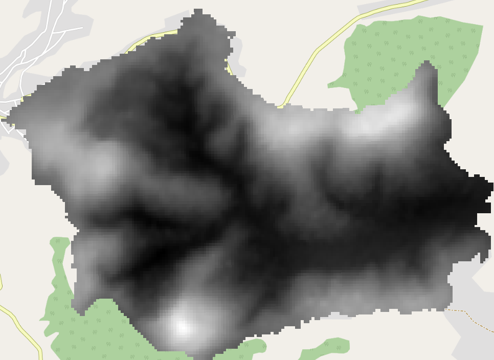

=======================
Creating a simple model
=======================

In this exercise we will be creating a simple model with
:doc:`/docs/user_manual/processing/modeler`. In this exercise you will work with
Model Builder yourself. This is an important tool since you will use it often in
Chapter 3 of this practical. Here you will automate a series of operations so
that they can be executed with just one click. It will also allow you to make
changes to parameter settings and then quickly re-run the model. This allows you
to compare changes in your model output and link them to the changes that you
made earlier. In this exercise, you will create a model that determines the
Topographic Position Index (TPI) of a DEM. The TPI is given by the equation:

.. math:: TPI=DEM-\mathrm{focalmean}\left(DEM,annulus,r_i,r_o\right)

The TPI can be used to determine whether a location is on a ridge or valley.
This can be useful when you are creating your own adaptation strategies! 

As you can see in :numref:`fig_tpi`, the TPI can differ, based on the radius.
This is useful so you can distinguish between large and small features.

.. _fig_tpi:

.. figure:: https://landscapearchaeology.org/figures/TPI_diagram.png
   :align: center

   Topographic index depends on Neighborhood size. (https://landscapearchaeology.org/2019/tpi/)

|basic| implementing the model with |grassLogo| :guilabel:`r.neighbors` 
------------------------------------------------------------------------

The |grassLogo|:guilabel:`r.neighbors` algorithm does not support an annulus as area
by default. However, it provides the possibility to use a *mask file*. That is a
:file:`.txt` file that looks something like this for :math:`r_i=1,r_o=3` :

.. literalinclude:: scripts/r_1_3

Where all :math:`1`'s are taken into account. The script that we need creates
this file for us. In the next subsection, we will be making this script
ourselves. You can also directly copy it from the :ref:`solution
<mask_script_solution>`.

|basic| |FA| Getting the model inputs
.....................................

#. In the Processing toolbox, select 
   |processingModel|:menuselection:`--> Create new Model`

   .. figure:: img/create_model.png
      :align: center

   The following window will show:

   .. figure:: /docs/user_manual/processing/img/modeler_canvas.png
      :align: center

   Our TPI model needs three inputs: 
   
   * A Digital Elevation Model (DEM) raster
   * The inner radius for the zonal statistics
   * The outer radius for the zonal statistics

#. In the *Inputs* pane, scroll down until you see
   |signPlus|:guilabel:`Raster Layer`. drag it into the model view. The
   following dialog will show:

   .. figure:: img/raster_input_dialog.png
      :align: center
   
   Enter :file:`DEM` as name and press :guilabel:`OK`.

   .. note::
      The checkboxes define how the inputs are shown when you open a model:

      * Your created model will not run without |checkbox|:guilabel:`Mandatory`
        inputs
      * |unchecked|:guilabel:`advanced` inputs will be under a drop-down menu

#. Drag a |signPlus|:guilabel:`Number` into  the modeler. Give it a:

   * :guilabel:`Description`: :file:`Outer radius`
   * :guilabel:`Number type`: :file:`Integer`
   * :guilabel:`Minimum value`: :file:`1`
   * :guilabel:`Default value`: :file:`3`

   Your modeler should now look like this:

   .. _fig_model_inputs_grass:

   .. figure:: img/model_inputs.png
      :align: center

      Model with only inputs
   
   .. tip:: Snapping
      You can enable snapping by :menuselection:`View --> Enable snapping`

#. **|TY|** Add another input for the inner radius.
#. Name the model :file:`Topographic Position Index (TPI)` and |fileSave| Save
   it with a logical name such as :file:`tpi.model3` 
#. close the modeler for now

|hard| |FA| Creating a script for the mask file
...............................................

Now, to get the |grassLogo|:guilabel:`r.neighbors` algorithm to work correctly, we
need to create a mask file script.

.. warning::
   This is a |hard| exercise. Only do this if you have extra time left.
   Otherwise, go directly to the :ref:`solution <mask_script_solution>`. Doing
   this exercise will also help you with :ref:`create_rasterize_script`.

#. We will create a model that we will convert to a script. Click
   |processingModel|:menuselection:`--> Create New Model...`
#. Drag in the following inputs:
   
   * |signPlus|:guilabel:`Number`: 

     * :guilabel:`Description`: :file:`Inner radius`
     * :guilabel:`Number type`: |fieldInteger|:file:`Integer` 
     * :guilabel:`Minimum value`: :file:`0` 
     * :guilabel:`Default value`: :file:`1` 

   * |signPlus|:guilabel:`Number`: :file:`Outer radius`, similar to Inner radius

#. Name the model :file:`Annulus mask for r.neighbors`
#. Click the |saveAsPython| *Export as Script Algorithm* icon. 

   The following script will appear. Places where we will insert some of our own
   code are highlighted.

   .. literalinclude:: scripts/annulus_r_neighbors.py
      :lines: 1-11,13, 16-21,23-27,39-58
      :emphasize-lines: 11,13, 18, 23
      :linenos:

#. In the model, we have only added two inputs. However, our algorithm should also have
   an output. At line 11, insert the following:

   .. literalinclude:: scripts/annulus_r_neighbors.py
      :lines: 12
   
   and within the :code:`initAlgorithm` function (line 18) insert:

   .. literalinclude:: scripts/annulus_r_neighbors.py
      :lines: 22

#. There is one problem with these processing parameters, however: they are not actually
   values that we can work with. However, we want to be able to use them as numbers or strings (in
   the case of file names). For this we will use the :func:`parameterAsInt()` and
   :func:`parameterAsFileDestination()` At line 23, insert the following: 

   .. literalinclude:: scripts/annulus_r_neighbors.py
      :lines: 29-32

#. What we want is a function that creates a file like below for an inner, resp. outer
   radius  of: :math:`r_i=1,r_o=3`

   .. literalinclude:: scripts/r_1_3

   This file is a mask file with weights e.g. numbers between 0 and 1, that tell GRASS
   how much this cell matters for the calculation of the tpi.
   
   .. note::

      I did not come up with these calculations myself, but found them on stackexchange.
      Sadly, I forgot where.
   
   Note that the 0 in between
   all the 1s is the center is the point that corresponds to the center. It is actually at coordinates
   :math:`(x_0,y_0)=(3,3)` (start counting at 0). This is what |grassLogo|:guilabel:`r.neighbors` expects. It follows that
   :math:`x_0=y_0=r_o`. Let :math:`d` be the distance to this point. Then, we want all
   points to be 1 for which:

   .. math:: d\geq r_i \land d \leq r_0

   holds and 0 otherwise. The (eucludian) distance can be calculated by:

   .. math::
      d := \sqrt{(x-x_0)^2+(y-y_0)^2}\\
        = \sqrt{(x-r_o)^2+(y-r_o)^2}

   where :math:`x,y` are the coordinates of the Currently processed point.
   To put this in code, we first need to import the corresponding functions:

   .. literalinclude:: scripts/annulus_r_neighbors.py
      :lines: 15

   and then make the calculations. Here :code:`a ** b` means :math:`a^b`. Also note
   that the size of our array is :math:`2r_o+1`

   .. literalinclude:: scripts/annulus_r_neighbors.py
      :lines: 34, 35

   Then, we save our file to :code:`outloc` in decimal (:code:`"%d"`) format:

   .. literalinclude:: scripts/annulus_r_neighbors.py
      :lines: 37

Your final script should look like this:

.. _mask_script_solution:

.. admonition:: |basic| Solution
   :class: dropdown

   If you didn't follow the above |FA|, you can use the below script. 

   #. In the Processig Toolkbox, click the 
      |pythonFile|:menuselection:`--> Create New Script...`
   #. copy-paste the following code into the text editor that popped up:

      .. literalinclude:: scripts/annulus_r_neighbors.py
         :emphasize-lines: 12,15,22,29-37
         :linenos:

   #. |fileSave| Save the script. It should now show up in the toolbox:

      .. figure:: img/script_in_toolbox.png
         :align: center

|basic| Testing the annulus mask
.................................

Now you have made the annulus mask file, either by following the instructions or
skipping to the solution, now it is time to test whether the annulus mask we just made actually works.

#. Search for :file:`annulus mask for r.neighbors` in the processing pane and run it.

   Use default settings, but set |guilabel|`annular mask` to a file name with a :file:`.txt` extension

   .. figure:: img/test_annulus.png
      :align: center

#. open the file and verify if it is made correctly.

|basic| Adding the processes to the TPI model
.............................................

Now we have all the processes we need, it is time to add them to our model!

#. Click :guilabel:`Algorithms` (highlighted in :numref:`fig_model_inputs_grass`).
#. Search for your script and drag it into the modeler. Fill it in like this:
   
   .. figure:: img/grass_script_prompt.png
      :align: center
   
   You can change the type of variable by clicking the highlighted
   |processingModel|. You can then choose from:

   * |fieldInteger| :guilabel:`Value` A value
   * |processingModel| :guilabel:`Input` An input to your model (|signPlus|)
   * |processingAlgorithm| :guilabel:`Algorithm output` The output of an algorithm
   * |expression| :guilabel:`Pre-calculated value` An expression that will be
     evaluated when you run the model

#. Next, drag in the |grassLogo|:guilabel:`r.neighbors` algorithm. The mask option
   we are using is an advanced parameter. Click the 
   :guilabel:`Show avancedparameters` button. Then fill it in like this:
   
   * :guilabel:`Using model input`: |processingModel|:file:`DEM`  
   * :guilabel:`Neighborhood operation [optional]`: |fieldInteger|:file:`average` 
   * :guilabel:`Neighborhood size (must be odd) [optional]`:
     |processingModel|:file:`outer radius`
   * :guilabel:`File containing weights [optional]`:
     |processingAlgorithm|:file:`"annular mask" from algorithm "annulus mask for r.neighbors"`  
   
   press :guilabel:`OK` 

.. note::
   For some reason, the |logo| native raster calculator does not work well with output
   of |saga| Saga or |grassLogo| Grass algorithms. Please use the |gdal| :ref:`gdalrastercalculator` for
   this exercise. Instructions are still added, because you may find it more
   intuitive to use than the GDAL version later on in the manual.

#. Drag the |gdal|:ref:`gdalrastercalculator` into the view. Fill in the dialog
   as follows:

   * :guilabel:`Input layer A`: |processingModel|:file:`DEM`
   * :guilabel:`Number of raster band for A`: :file:`1` This is for multi-band
     rasters. Since our raster only has one band, we want that to be :math:`1`.
   * :guilabel:`Input layer B`:  
     |processingAlgorithm|:file:`"neighbors" from algorithm "r.neighbors"` 
   * :guilabel:`Number of raster band for B`: :file:`1`
   * :guilabel:`Calculation in gdalnumeric syntax`: :file:`A-B`
   * |modelOutput|:guilabel:`Calculated`: :file:`TPI`

   Your model should now look like this:

   .. figure:: img/grass_model_final.png
      :align: center

#. Run your model with :math:`r_i=62,r_o=67`. Your output should look like this:

|basic| Implementing the algorithm with |saga| Focal statistics
---------------------------------------------------------------

.. warning:: The following section was written for |win| QGIS with |saga| SAGA 7.8. This
   version has different algorithms available than |nix| |osx| |SAGA| version
   7.3. In that case, use the |grassLogo| ::guilabel:`r.neighbors`  algorithm.

#. In the Processing toolbox, select 
   |processingModel|:menuselection:`--> Create new Model`

   .. figure:: img/create_model.png
      :align: center

   The following window will show:

   .. figure:: /docs/user_manual/processing/img/modeler_canvas.png
      :align: center

   Our TPI model needs three inputs: 
   
   * A Digital Elevation Model (DEM) raster
   * The inner radius for the zonal statistics
   * The outer radius for the zonal statistics

#. In the *Inputs* pane, scroll down until you see
   |signPlus|:guilabel:`Raster Layer`. drag it into the model view. The
   following dialog will show:

   .. figure:: img/raster_input_dialog.png
      :align: center
   
   Enter :file:`DEM` as name and press :guilabel:`OK`.

   .. note::
      The checkboxes define how the inputs are shown when you open a model:

      * Your created model will not run without |checkbox|:guilabel:`Mandatory`
        inputs
      * |unchecked|:guilabel:`advanced` inputs will be under a drop-down menu

#. Drag a |signPlus|:guilabel:`Number` into  the modeler. Give it a:

   * :guilabel:`Description`: :file:`Outer radius`
   * :guilabel:`Number type`: :file:`Integer`
   * :guilabel:`Munimum value`: :file:`1`
   * :guilabel:`Default value`: :file:`3`

   Your modeler should now look like this:

   .. _fig_model_inputs_saga:

   .. figure:: img/model_inputs.png
      :align: center

      Model with only inputs
   
   .. tip:: Snapping
      You can enable snapping by :menuselection:`View --> Enable snapping`

#. Now, we are going to include our first algorithm. 

   #. Click :guilabel:`Algorithms` (highlighted in :numref:`fig_model_inputs_saga`).
   #. Search for |saga|:guilabel:`Focal Statistics`, drag it into the view and
      fill in the pop-up window as follows:

      * Under :guilabel:`Grid`, press the |fieldInteger| drop-down and select
        |processingModel|:guilabel:`Model Input`. It should be on :File:`DEM`
        already since this is the only raster type model input.
      * :guilabel:`Include Center Cell`: |fieldInteger|:file:`No`
      * :guilabel:`Kernel Type`: |fieldInteger|:file:`[1] Circle`
      * :guilabel:`Radius`: |processingModel|:file:`Outer radius`
      * the rest on default settings
   
   #. Press :guilabel:`OK`

      Your model should now look like this (with some rearranging):

      .. figure:: img/model_focal_statistics.png
         :align: center

.. note::
   For some reason, the |logo| native raster calculator does not work well with output
   of |saga| Saga algorithms. Please use the |gdal| :ref:`gdalrastercalculator` for
   this exercise. Instructions are still added, because you may find it more
   intuitive to use than the GDAL later on in the manual

#. Drag the |gdal|:ref:`gdalrastercalculator` into the view. Fill in the dialog
   as follows:

   * :guilabel:`Input layer A`: |processingModel|:file:`DEM`
   * :guilabel:`Number of raster band for A`: :file:`1` This is for multi-band
     rasters. Since our raster only has one band, we want that.
   * :guilabel:`Input layer B`:  
     |processingAlgorithm|:file:`"Mean value" from algorithm "Focal Statistics"` 
   * :guilabel:`Number of raster band for B`: :file:`1`
   * :guilabel:`Calculation in gdalnumeric syntax`: :file:`A-B`
   * |modelOutput|:guilabel:`Calculated`: :file:`TPI`

.. admonition:: |logo| Raster calculator
   :class: dropdown

   #. Drag the |logo|:guilabel:`Raster calculator` into the view. Fill in the
      dialog as follows:

      * :guilabel:`Expression`: 
        :file:`"DEM@1"-"'Mean Value' from algorithm 'Focal Statistics'@1"`. Get the
        names by double-clicking them in the :guilabel:`Layers` list.
      * :guilabel:`Reference Layers (...)`:
        :menuselection:`... -->`|checkbox|:guilabel:`DEM`.
      * |modelOutput|:guilabel:`Output`: :file:`TPI`

      and press :guilabel:`OK`.

      .. note::
         In :file:`DEM@1`, the :file:`@1` refers to *Band 1*. Thus, the raster
         calculator supports operations on rasters with multiple bands.
      
#. Press :guilabel:`OK` to add it to the model. It should now look like this:

   .. figure:: img/model_full.png
      :align: center

#. Before we can save our model, we have to give it a name. Below
   :guilabel:`Model Properties`, give it the :guilabel:`Name` 
   :file:`Topographic Position Index (TPI)`
#. Save your model by pressing the |fileSave| icon or :kbd:`Ctrl+S`. Give it a
   descriptive name.

Running the model
-----------------

.. note::
   Currently (Oct 2021), layers from a GeoPackage cannot be selected as raster
   inputs in the Graphical Modeler. See the related 
   `Feature request <https://github.com/qgis/QGIS/issues/38607>`_ and a 
   `Possible workaround <https://gis.stackexchange.com/questions/329294/adding-a-geopackage-layer-as-a-hardwired-input-to-an-algorithm-in-the-qgis-graph>`_
   .
   However, we will be working around this by loading our data into the project first.

#. Load the :guilabel:`Hadocha_dem` layer into your map if it isn't there yet.
#. Now we have created the model, it is time to run it! There are two ways to do
   so:

   #. From within the Graphical Modeler:
      
      Press the |play| button or :kbd:`F5`.

   #. From the Processing Toolbox:

      Notice that there is a new drop-down menu labeled
      |processingModel|:guilabel:`Models`. There, your model named 
      |processingModel|:guilabel:`Topographic Position Index` is shown. Run it
      like any other tool!

#. Either way, now select :file:`Hadocha_DEM` as :guilabel:`DEM`. and 
   :guilabel:`outer radius` :file:`3`. :guilabel:`Run` the model and your output
   should look like this:
   
   .. figure:: img/TPI.png

|IC| Wrapping up
----------------

Now, you have learned how to use the graphical modeler and to calculate the
Topographic Position Index. Both are very useful. We will excessively use the
Graphical Modeler later for the MMF erosion model, and you could use the TPI for
determining where to apply specific measures.

.. Substitutions definitions - AVOID EDITING PAST THIS LINE
   This will be automatically updated by the find_set_subst.py script.
   If you need to create a new substitution manually,
   please add it also to the substitutions.txt file in the
   source folder.

.. |FA| replace:: Follow Along:
.. |IC| replace:: In Conclusion
.. |TY| replace:: Try Yourself
.. |basic| image:: /static/common/basic.png
.. |checkbox| image:: /static/common/checkbox.png
   :width: 1.3em
.. |expression| image:: /static/common/mIconExpression.png
   :width: 1.5em
.. |fieldInteger| image:: /static/common/mIconFieldInteger.png
   :width: 1.5em
.. |fileSave| image:: /static/common/mActionFileSave.png
   :width: 1.5em
.. |gdal| image:: /static/common/gdal.png
   :width: 1.5em
.. |grassLogo| image:: /static/common/grasslogo.png
   :width: 1.5em
.. |hard| image:: /static/common/hard.png
.. |logo| image:: /static/common/logo.png
   :width: 1.5em
.. |modelOutput| image:: /static/common/mIconModelOutput.png
   :width: 1.5em
.. |nix| image:: /static/common/nix.png
   :width: 1em
.. |osx| image:: /static/common/osx.png
   :width: 1em
.. |play| image:: /static/common/mActionPlay.png
   :width: 1.5em
.. |processingAlgorithm| image:: /static/common/processingAlgorithm.png
   :width: 1.5em
.. |processingModel| image:: /static/common/processingModel.png
   :width: 1.5em
.. |pythonFile| image:: /static/common/mIconPythonFile.png
   :width: 1.5em
.. |saga| image:: /static/common/providerSaga.png
   :width: 1.5em
.. |saveAsPython| image:: /static/common/mActionSaveAsPython.png
   :width: 1.5em
.. |signPlus| image:: /static/common/symbologyAdd.png
   :width: 1.5em
.. |unchecked| image:: /static/common/unchecked.png
   :width: 1.3em
.. |win| image:: /static/common/win.png
   :width: 1em
